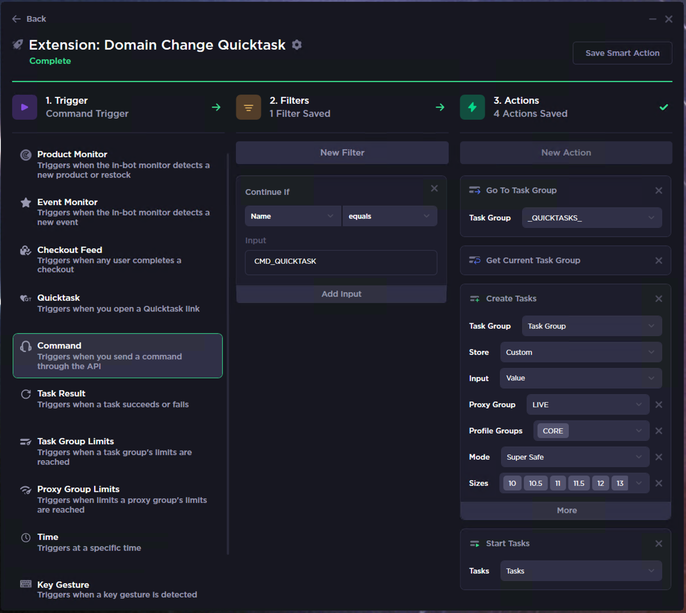
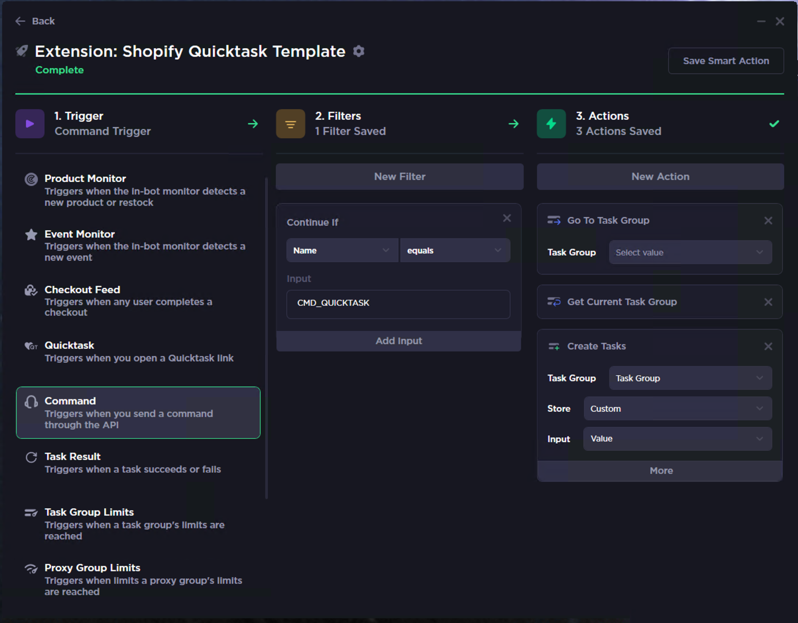

# Cybersole Launcher #

---

## What is this?

Cybersole's API allows you to send arbitrary commands to an instance or instances.
This Chrome extension will send commands to the Cybersole API and can be used to trigger Smart Actions from your browser.


## Usecase: What exactly is this useful for?

The number one use case is _really really fast task creation on domain change drops_.  Create a Smart Action that is set up for a domain change drop - once you get the domain change, in Chrome go to the product you want to cop, then trigger the extension.  Instant task creation!



This is also super-useful for mass link changing on drops where keywords and SKUs won't work (KAWS, Hellstar, etc), you're gonna be using Chrome to manually hunt down a product and want to be super-fast.

## Installation + Setup

1. **Download the release or clone this repo**

2. **Install the Unpacked Extension**
  * Go to [Chrome Extensions](chrome://extensions/) in Chrome
  * At the top, click `Load Unpacked`
  * Navigate to wherever you just parked this extension

3. **Create your Cybersole API Key**
  * Go to [Your Account in Cybersole Dashboard](https://cybersole.io/dashboard/account)
  * Log in if needed
  * Create an API key with the following scopes:
    - `commands.write`
    - `instances.list`
  * Click Create
  * Copy your new API key
> [!TIP]
Give it a desciptive name so you remember what it's for.

4. **Set up the Extension**
  * Click the Cybersole icon in chrome (or right-click icon + navigate to `Options`)
  * Enter your API key
  * Select the instance that you want to send commands to
  * Select the command you want to send

5. **Set up Cybersole Smart Actions**
  * Import the included smart action templates, or create your own smart actions
  * Smart Action templates are in the `smartActions` folder
  * There are three templates (`Shopify`, `Mass Link Change` and `Nike`)
  * You can import these by opening Cybersole and going to `Options/Data` and selecting `Smart Actions`


## Usage

1. **Go to page with something you want to cop**
2. **Trigger Extension**
- Click Cybersole icon
- (or) trigger via keybind
3. **Good Luck**

> [!TIP]
Use Keybinds / Shortcuts!
Keybinds make this even quicker and much more dangerous - go to [Chrome Shortcuts](chrome://extensions/shortcuts). Find `Cybersole Launcher`. Add a key binding to trigger the extension!


## Smart Action Setup

> [!IMPORTANT]
When making your own smart actions, the `Name` variable will be the command code.  The `Value` variable will be set according to which command you have selected - for example with the Shopify Quicktask, `Name` will be set as `CMD_QUICKTASK` and `Value` will be the URL of the active page in the Chrome window.

> [!IMPORTANT]
If you are wanting to use the extension on any possible Shopify site, use `Custom` for the Store in the `Create Tasks` action.  If you want to kind-of-filter the incoming command, you can set a specific store in the Smart Action.  In that case the action will still run if you have a mismatched Store and Command URL, but the action will make a task that will never find a product.


**Shopify Quicktask**
```
name/command: CMD_QUICKTASK
value: chrome's current full page url
```
  
**Mass Link Change**
```
name/command: CMD_MASS_LINK_CHANGE
value: chrome's current full page url
```

**Nike Quicktask**
```
name/command: CMD_NIKE_QUICKTASK
value: parses the url for the page SKU and sends the SKU (if on a nike site)
```


## More Info and Stuff

**Read more about Cybersole API Commands here:**
[Cybersole API docs](https://docs.cybersole.io/)

> [!TIP]
You can edit the `commands.js` file to add your own custom commands. You will probably also want to extend the `callAPI()` function to parse the url (say, for a SKU), or do a regex on the page contents, or whatever.


# Credits + Links #
- [Cybersole](https://cybersole.io/)
- [Cybersole API Docs](https://docs.cybersole.io)
- [Lucas](https://github.com/lucastitus)
- [Arno](https://github.com/arnofrutos)
